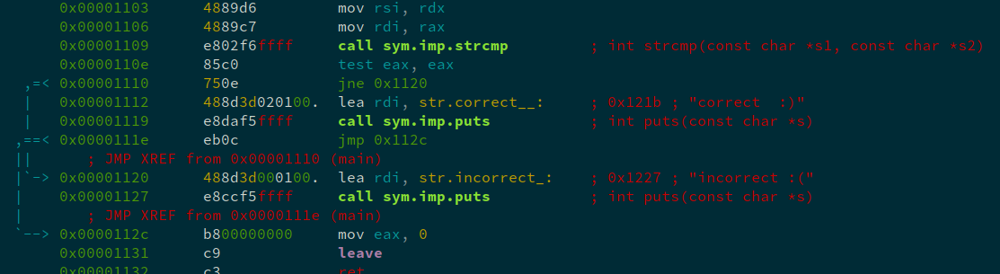
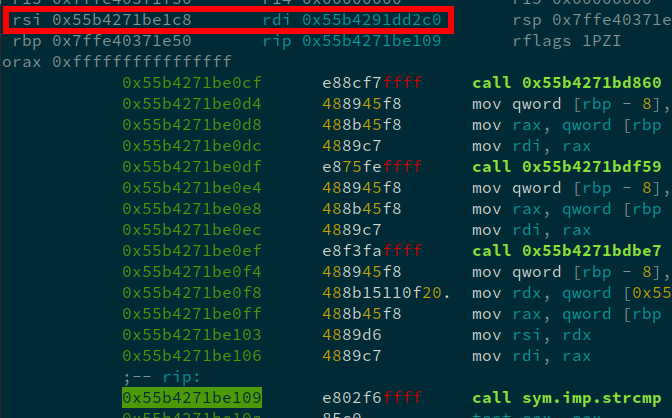
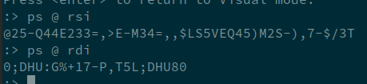
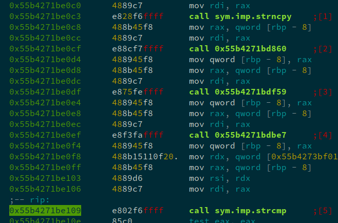
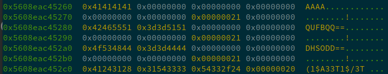
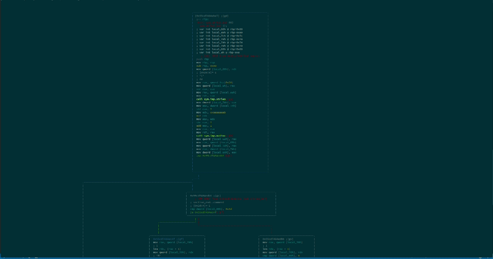

# TokyoWesterns 2018: dec dec dec
**Category**: Reversing - **Points**: 99

## Problem:
> [dec_dec_dec](./dec_dec_dec-c55c231bfbf686ab058bac2a56ce6cc49ae32fe086af499571e335c9f7417e5b)  

# Writeup

## What's the password?

All that's given in the problem statement is a single file. A quick inspection of the file in a hex editor shows that it's executable.
After a `chmod +x` we can run the program and get to the interesting bits.

Running the program gives this message:
```                  
$ ./dec     
./dec flag_string_is_here
```
And with an input string:
```
$ ./dec 'I am an input!'
incorrect :(
```

So the task at hand is to craft an input string that the program deems correct. This correct input string is the flag.

## Finding the password

Using radare2 to disassemble `main`, we can se the point where the program decides if the input was correct (a `strcmp` call):



This assembly is saying:
```
if (strcmp(some_string, another_string) == 0){
    printf("correct :)");
} else {
    printf("incorrect :(");
}
```

If we can make both strings in the the `strcmp` call equal to each other (in which case `strcmp` returns 0), we know our input string was the flag.

Using radare2 as a debugger, we can look at the contents of the registers `rsi` and `rdi` at the time of the function call. In x86, These two registers are where the first two arguments of any function call go.

  

These values are the locations (on the heap) of the two strings that are being compared. We can read them with radare2's `ps @ <location>` command ("print string at \<location\>"):

  

The top string (where `rsi` is pointing) is a hard coded string which is the same every time. That's our password! The bottom string (where `rdi` is pointing) changes whenever our input string changes. 

## It's never that easy

Just before the `strcmp`, the program does some mischief and messes with our input string:



The program messes our input up with three mischief functions. >:(

If we give the program a simple input we can take a look at the return values after every function to get an idea of what's going on. Conviently for this writup, the program doesn't do a great job of cleaning up memory, so we can view the stages of the mischief all in one place:



Here we see our original input string (`AAAA` in this case), what the first mischief function turned it into (`QUFBQQ==`), what the second mischief function turned *that result* into (`DHSODD==`), and finally, the result of the third mischief function, which turns `DHSODD==` into `1$A33T1$/3T `. This final result is run through the `strcmp` mentioned earlier. Therefore, we need the result of the third mischief function to match `@25-Q44E233=,>E-M34=,,$LS5VEQ45)M2S-),7-$/3T `.

## The mischief functions

Luckily, I recognized the characteristic `'=='` of base64 encoding on the end of the first stage and confirmed that it indeed was base64.

The second transformation can be recognized as most likely some kind of ROT encoding. This is because of both the consistent letter transformations (`Q` always becomes `D`) and the unchanged string length. A `ROT #` encoding simply takes a letter in the alphabet and changes it to a letter `#` letters backwards in the alphabet from it. For example, ROT 3 changes an `a` to a `x`. (`a -> z -> y -> x`, 3 steps).

I copied `DHSODD==` and put it into [this website](http://fbcs.bplaced.net/multi_encoder_decoder.html), pressed decode, and sure enough, `QUFBQQ==` was in the ROT 13 box.

So stage one encodes the input in base64.
Stage two applies ROT 13 to the result.

However, I didn't recognize the third encoding. This is when I had to get my hands dirty.

## Dirty Hands

To reverse engineer the third mischief function, I stepped into it and opened up radare2's graph view to get a general idea of what I was dealing with:



Oh boy.

If you look closely, you will notice that there's two main branches. The branch on the left only gets executed if your input string is longer than 45 characters. If the left branch gets executed, the output string always starts with an `M`. Since `@25-Q44E233=,>E-M34=,,$LS5VEQ45)M2S-),7-$/3T ` doesn't start with an `M`, I knew I didn't have to bother reversing the left branch.

After slowly stepping through the right branch, I mapped out the process, and wrote a [python script](encode.py) to emulate it.

## [The encoder script](encode.py)

At a very high level, the encoder does the following:
- The first byte of the output is a function of soley the length of the input.
- Process input bytes 3 at a time. 
- Output 4 bytes per 3 byte chunk.
    - The first output byte depends solely on the input chunk's first byte
    - The second output byte depends on both the first and second bytes of the input chunk
    - The third output byte depends on both the second and thrid bytes of the input chunk
    - The fourth output byte depends solely on the third input byte
- Any given 3 byte input chunk will always produce the same 4 byte output chunk, regardless of position or surrounding bytes.

The acutal encoder code used in `dec` misbehaves a little. The encoding process it uses assumes that the input has a length that is a multiple of 3. If the input does not have a length that is a multiple of 3, the encoder will include bytes after the end of the input string as if they were part of the input string. Thankfully, the object it steals bytes from is a small number stored in an 8 byte buffer (a small 64 bit integer or similar), so the bytes that get stolen are always `0x00`. To emulate this in my encoder, I just padded the input string with `0x00` bytes until its length was a multiple of 3.

## [The decoder script](decode.py)

Now, the final step was to reverse engineer my own encoder script, write a [decoder script](decode.py), and then decode `@25-Q44E233=,>E-M34=,,$LS5VEQ45)M2S-),7-$/3T `.

From what I knew about the encoding process, I knew the following would be true about the decoding process:
- The first character of the encoded string depends solely on the length of the input string. This meant that I could ignore the encoded string's first character in my decoder, since it didn't actually contain any information about the characters of the input.
- For every 3 characters in the input, the encoder produced 4 characters in the output. A given 3 character sequence will always produce the same 4 character sequence as an output. This meant that my decoder could iterate over the output string in chunks of 4 characters and deduce the 3 characters that created them.

The basic ideas for each 4 byte chunk processed by the decoder were:
1. Since the first output character depends soley on the first input character, we can find possible first input characters based only on the first output character. As it turns out, there are always 4 possibilities.
2. Since the second output character depends on both the first and second input character, I take the list of possible first input characters from the previous step and test what characters could possibly combine with them to produce the second output character.
    - Through some evil mathematical magic, it turns out that only one of the characters from the first input list can ever combine with a character to produce the second output. This narrows down the first input list to one character, so we now know what the first character was. However, we still have a long list of possible second characters.
3. Since the third output character depends on both the second and third input character, I take the list of possible second input characters from the previous step and test what characters could possibly combine with them to produce the third output character.
    - Again, through some evil mathematical magic, it turns out that only one of the characters from the second input list can ever combine with a character to produce the third output. This narrows down the second input list to one character, so we now know what the second character was. We still have a long list of possible third characters.
4. Lastly, since the fourth output character depends soley on the third input character, we can narrow the possibilities down like we did for the first character and create a list of possible third input characters seperate from the list we made in the previous step. 
5. Now, if we take the intersection of the lists made in steps 3 and 4, we have a smaller list of possible third characters. Through the strangest, darkest mathematical magic of all, it turns out that this newly formed list is always one character long.

Repeat these steps for every 4 byte chunk in the string you're decoding.

## Un-mischieving

With a working decoder, we can now run `@25-Q44E233=,>E-M34=,,$LS5VEQ45)M2S-),7-$/3T ` through it. That gives us:

`ISqQIRM7LzSmMGL0K3WiqQRmK3I1sD==`

Running this through a ROT 13 decoder gives us...

`VFdDVEZ7YmFzZTY0X3JvdDEzX3V1fQ==`

Running this through a base64 decoder gives us...

`TWCTF{base64_rot13_uu}`

The flag!

```
$ ./dec 'TWCTF{base64_rot13_uu}'
correct :)
```

> As it turns out, the third encoding is actually an already esablished one. As the flag implies, it's called [uu encoding](https://en.wikipedia.org/wiki/Uuencoding). I didn't have to do all of this work after all... oh well :)